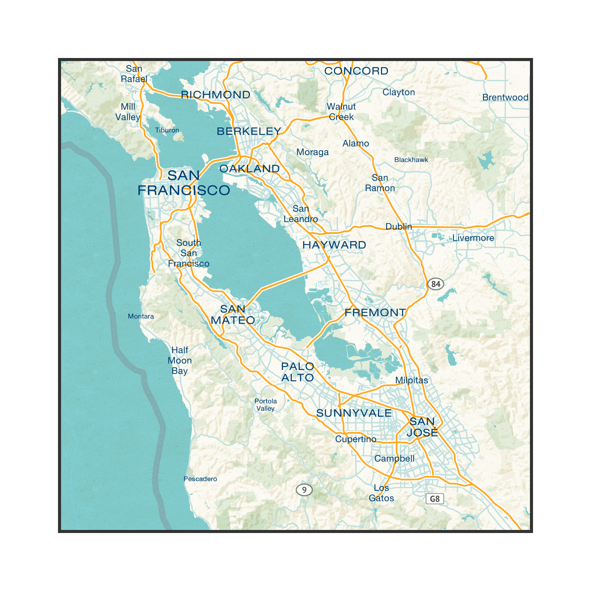

mapbox2image
============

[Mapbox](https://www.mapbox.com) allows for creation of truly beautifully-styled maps, but rendering them to
static images is not currently [supported](https://www.mapbox.com/help/export-image-pdf/).

This tool uses Mapbox API to generate
large scale map image files that are highly customizable and can be used for
printing purposes like
brochures, wall posters, last page walking directions and so on.

-------------
###Example:
create an `areas.json` with:
```javascript
{
  "Silicon Valley": {
      "name": "Silicon Valley (A4 - compatible)",
      "url": "sv",
      "z":10,
      "tileRange": {
          "Min":{
              "X":163,
              "Y":395
          },
          "Max":{
              "X":166,
              "Y":398
          }
      }

    }

}

```
and here us what we get:


License: MIT
